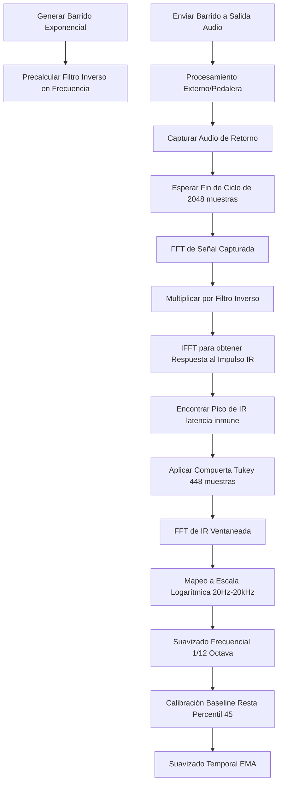

# Módulo Block Analyzer: Especificación Técnica y Guía de Implementación en Python

Este documento describe detalladamente el funcionamiento y los algoritmos del módulo **Block Analyzer** (basado en el método de barrido sinusoidal exponencial o *Farina Method*) implementado en C++ en este proyecto. El objetivo es proporcionar todas las fórmulas matemáticas, consideraciones de diseño y un código de referencia funcional en Python utilizando `numpy` y `scipy` para facilitar su migración.

---

## 1. Concepto y Arquitectura General

El **Block Analyzer** es un analizador de curvas de ecualización (función de transferencia) en tiempo real de latencia ultra-baja y alta resolución. Replica el comportamiento de herramientas profesionales como *Waves Q-Clone*. 

Opera bajo los siguientes pilares:
1. **Barrido Periódico Continuo:** Genera y reproduce un barrido sinusoidal exponencial de exactamente **2048 muestras** (aprox. 46.4 ms a una tasa de muestreo de 44.1 kHz).
2. **Deconvolución Circular:** Como la señal es periódica y en bucle continuo, la deconvolución se realiza de forma directa y eficiente mediante divisiones en el dominio de la frecuencia (multiplicación por el filtro inverso exacto precalculado).
3. **Compuerta Temporal (Time-Gating):** Transforma la respuesta de frecuencia cruda de vuelta al dominio del tiempo (Respuesta al Impulso o IR), aísla el pico de la IR lineal descartando la latencia del sistema y las distorsiones armónicas, y aplica una ventana de atenuación para eliminar el ruido residual.
4. **Suavizado y Calibración:** Aplica suavizado por octavas, calibración dinámica de la línea base a 0 dB y filtros de promedio móvil exponencial (EMA) para una visualización fluida y libre de fluctuaciones (jitter).



---

## 2. Descripción Paso a Paso del Proceso

### Paso 1: Generación del Barrido Exponencial (Sweep)
El barrido se genera analíticamente en base al método de Angelo Farina. Su fase varía exponencialmente con el tiempo, lo que permite que las distorsiones armónicas no lineales se concentren a la izquierda (antes) del impulso lineal principal en la IR final.

* **Parámetros:**
  * Longitud del barrido ($L$): $2048$ muestras.
  * Frecuencia inicial ($f_1$): $20.0 \text{ Hz}$.
  * Frecuencia final ($f_2$): $20000.0 \text{ Hz}$.
  * Tasa de muestreo ($f_s$): $44100.0 \text{ Hz}$ (u otra según hardware).
  * Duración en segundos ($T$): $L / f_s$.
  * Tasa de incremento exponencial ($R$): $\ln(f_2 / f_1)$.

* **Ecuación de Fase:**
  $$\phi(t) = 2\pi \cdot \frac{f_1 T}{R} \cdot \left(e^{\frac{t \cdot R}{T}} - 1\right)$$
  Donde $t = n / f_s$ para $n \in [0, L-1]$.

* **Muestra del Barrido:**
  $$s[n] = \sin(\phi(t))$$

* **Micro-desvanecimiento (Micro-fade):**
  Para evitar clics de discontinuidad en los bordes de la señal periódica al hacer el bucle, se aplica una rampa de desvanecimiento lineal muy corta (1 ms) en los extremos:
  $$fadeSamples = \min(0.001 \cdot f_s, \, L / 16)$$

### Paso 2: Cálculo del Filtro Inverso Circular en Frecuencia
Para deconvolucionar, se necesita el filtro inverso del barrido. Al ser un proceso circular periódico, esto se realiza dividiendo $1 / S(f)$ en el dominio de la frecuencia. Este paso se realiza **una sola vez** al inicio o al cambiar la tasa de muestreo:

1. Se calcula la FFT real a compleja de la señal del barrido $s[n]$, obteniendo el espectro complejo $S(k)$ para $k \in [0, L/2]$.
2. Para evitar divisiones por cero o amplificación excesiva de ruido en las zonas donde el barrido no tiene energía, se introduce una constante de regularización de Tikhonov ($\epsilon = 10^{-4}$) y un filtro paso-banda suavizado ($bp[f]$) entre 15 Hz y 21 kHz.
3. El espectro del filtro inverso $S_{inv}(k)$ se define como:
   $$S_{inv}(k) = \frac{S^*(k)}{|S(k)|^2 + \epsilon} \cdot bp(f)$$
   Donde $S^*(k)$ es el conjugado complejo de $S(k)$.

### Paso 3: Transmisión y Captura en Tiempo Real
1. **Salida:** En el hilo de procesamiento de audio, se lee secuencialmente el buffer del barrido y se envía al canal de salida física hacia el procesador (por ejemplo, salida USB hacia la pedalera Helix), atenuado moderadamente (por ejemplo, a $-12 \text{ dBFS}$, multiplicador de $0.25$).
2. **Entrada:** Las muestras procesadas que regresan de la pedalera se capturan en un buffer de tamaño $L$.
3. **Sincronización:** Cada vez que el reproductor del barrido llega al final de las 2048 muestras, se notifica al capturador que se ha completado un ciclo y se dispara el análisis sobre el buffer lleno. El capturador vuelve a escribir desde la posición 0.

### Paso 4: Deconvolución Circular
Cuando se completa un ciclo del barrido:
1. Se calcula la FFT real de la señal capturada $y[n]$, obteniendo $Y(k)$.
2. Se multiplica de manera compleja por el espectro del filtro inverso precalculado $S_{inv}(k)$:
   $$H_{raw}(k) = Y(k) \cdot S_{inv}(k)$$
3. Se realiza la IFFT real de $H_{raw}(k)$ para obtener la respuesta al impulso en el dominio del tiempo $h_{raw}[n]$.

### Paso 5: Compuerta Temporal (Time-Gating) y Descarte de Latencia
Dado que la pedalera física y los buffers de audio USB introducen una latencia constante (del orden de cientos o miles de muestras), el pico de la respuesta al impulso se desplazará circularmente.
1. Se busca la posición del pico absoluto de la respuesta al impulso:
   $$peakIdx = \text{argmax}(|h_{raw}[n]|)$$
2. Se extrae una ventana compacta alrededor del pico (compuerta temporal) para aislar la respuesta lineal del ecualizador. Esto elimina reflexiones, ruido de alta frecuencia y distorsiones armónicas no lineales (que aparecen antes del pico lineal).
3. El tamaño de la compuerta temporal es de **448 muestras**: se toman **64 muestras antes** del pico y **384 muestras después** del pico.
4. Se aplica una ventana de Tukey (con desvanecimiento suave de coseno) para evitar fugas espectrales:
   * Fade-in de 32 muestras.
   * Parte plana (peso 1.0) de 352 muestras.
   * Fade-out de 64 muestras.
5. El resto de las 2048 muestras se rellenan con ceros.

### Paso 6: Transformación a Magnitud en Decibelios (dB)
1. Se calcula la FFT de la respuesta al impulso ventaneada y limpia, obteniendo $H_{gated}(k)$.
2. Para representar los datos de manera humana y musical, se mapean las magnitudes a una escala logarítmica de **512 bandas** espaciadas exponencialmente entre $20.0 \text{ Hz}$ y $20000.0 \text{ Hz}$.
3. Para cada banda $b \in [0, 511]$:
   * Se determina la frecuencia objetivo logarítmica: $f = f_1 \cdot \left(\frac{f_2}{f_1}\right)^{b / 511}$
   * Se mapea la frecuencia al índice de bin FFT más cercano: $k = \lfloor \frac{f}{f_s / 2} \cdot \frac{L}{2} \rfloor$
   * Magnitud en dB: $dB_b = 20 \log_{10}\left(\frac{|H_{gated}(k)|}{L}\right)$

### Paso 7: Suavizado y Calibración Final
1. **Suavizado Frecuencial:** Se aplica un filtro de promedio móvil con una ventana de 7 bins (ancho de banda equivalente a 1/12 de octava) para pulir micro-variaciones o imperfecciones numéricas.
2. **Calibración de la Línea Base:** Debido a ganancias analógicas y digitales, el espectro completo podría estar desplazado verticalmente. Para auto-calibrar la gráfica y que una señal plana (bypass) se alinee exactamente en $0 \text{ dB}$:
   * Se ordenan los valores de decibelios de las 512 bandas.
   * Se toma el valor en el percentil 45 de esta distribución como el offset de referencia.
   * Se resta este offset a todas las bandas, forzando la línea base a $0 \text{ dB}$.
   * Se limita el rango visual de salida entre $[-64.0 \text{ dB}, \, 24.0 \text{ dB}]$.
3. **Suavizado Temporal (EMA):** Se realiza una interpolación exponencial móvil en el tiempo para estabilizar la curva y simular una respuesta de hardware analógico:
   $$dB_{smooth}[b] = \alpha \cdot dB_{smooth}[b] + (1 - \alpha) \cdot dB_{new}[b]$$
   Donde $\alpha = 0.35$ proporciona una respuesta ultra-rápida y orgánica para los movimientos de potenciómetros en vivo.

---

## 3. Implementación de Referencia en Python (NumPy + SciPy)

A continuación, se detalla el código completo y listo para usar en Python. Este script define la clase `BlockAnalyzer` y simula su uso con señales dummy.

```python
import numpy as np
from scipy.fft import rfft, irfft

class BlockAnalyzer:
    def __init__(self, sweep_length=2048, sample_rate=44100.0):
        self.sweep_length = sweep_length
        self.sample_rate = sample_rate
        self.f1 = 20.0
        self.f2 = 20000.0
        self.num_bins = 512
        
        # Inicialización de buffers e indicadores
        self.sweep_buffer = np.zeros(self.sweep_length, dtype=np.float32)
        self.inv_fft_complex = np.zeros(self.sweep_length // 2 + 1, dtype=np.complex64)
        
        self.capture_buffer = np.zeros(self.sweep_length, dtype=np.float32)
        self.sweep_write_pos = 0
        self.capture_pos = 0
        
        self.magnitude_db = np.zeros(self.num_bins, dtype=np.float32)
        self.result_ready = False
        
        # Construir barrido y filtro de de-convolución circular
        self.build_sweep_and_inverse_filter()

    def build_sweep_and_inverse_filter(self):
        """Genera el barrido sinusoidal exponencial y su filtro inverso exacto."""
        T = self.sweep_length / self.sample_rate
        R = np.log(self.f2 / self.f1)
        
        # 1. Generar la señal del Sweep
        t = np.arange(self.sweep_length, dtype=np.float64) / self.sample_rate
        phase = 2.0 * np.pi * (self.f1 * T / R) * (np.exp(t * R / T) - 1.0)
        self.sweep_buffer = np.sin(phase).astype(np.float32)
        
        # Apliación de un micro-fade de 1 ms en los extremos (evita clics en reproducción continua)
        fade_len = min(int(0.001 * self.sample_rate), self.sweep_length // 16)
        w = np.arange(fade_len, dtype=np.float32) / fade_len
        self.sweep_buffer[:fade_len] *= w
        self.sweep_buffer[-fade_len:] *= w[::-1]
        
        # 2. Obtener el espectro del Sweep
        sweep_fft = rfft(self.sweep_buffer)
        
        # 3. Diseñar filtro inverso exacto regularizado
        nyq = self.sample_rate / 2.0
        freqs = np.fft.rfftfreq(self.sweep_length, 1.0 / self.sample_rate)
        
        power = np.abs(sweep_fft) ** 2
        eps = 1e-4  # Regularización de Tikhonov
        
        # Filtro de protección paso-banda (Bandpass Filter)
        bp = np.ones_like(freqs, dtype=np.float32)
        
        # Atenuación progresiva por debajo de 15 Hz
        lf_mask = freqs < 15.0
        bp[lf_mask] = np.maximum(0.0, (freqs[lf_mask] - 5.0) / 10.0)
        
        # Atenuación progresiva por encima de 21 kHz (hacia Nyquist)
        hf_mask = freqs > 21000.0
        bp[hf_mask] = np.maximum(0.0, (nyq - freqs[hf_mask]) / (nyq - 21000.0))
        
        # Inversión circular conjugada compleja
        self.inv_fft_complex = (np.conj(sweep_fft) / (power + eps)) * bp

    def get_next_sweep_sample(self):
        """
        Obtiene la siguiente muestra de audio para enviar al canal de salida.
        Normalmente se llama en el hilo de reproducción de audio a tiempo real.
        """
        # Reproducir a -12 dBFS (amplitud a 0.25)
        s = self.sweep_buffer[self.sweep_write_pos] * 0.25
        
        new_cycle = False
        self.sweep_write_pos += 1
        if self.sweep_write_pos >= self.sweep_length:
            self.sweep_write_pos = 0
            new_cycle = True
            
        return s, new_cycle

    def capture_sample(self, proc_sample, new_cycle_flag):
        """
        Captura una muestra proveniente del canal de retorno (loopback procesado).
        Si el flag 'new_cycle_flag' se activa, calcula la función de transferencia del ciclo previo.
        """
        if new_cycle_flag:
            if self.capture_pos == self.sweep_length:
                self.compute_transfer_function()
            self.capture_pos = 0
            
        if self.capture_pos < self.sweep_length:
            self.capture_buffer[self.capture_pos] = proc_sample
            self.capture_pos += 1

    def compute_transfer_function(self):
        """Realiza la deconvolución circular rápida, compuerta temporal, suavizado y calibración."""
        # 1. FFT de la señal capturada
        cap_fft = rfft(self.capture_buffer)
        
        # 2. Deconvolución por multiplicación en el dominio complejo
        ir_spec = cap_fft * self.inv_fft_complex
        
        # 3. IFFT para obtener la respuesta al impulso cruda en el tiempo
        ir = irfft(ir_spec)
        
        # 4. Encontrar pico absoluto de la IR (inmunidad a latencia física externa)
        peak_idx = np.argmax(np.abs(ir))
        
        # 5. Aplicar compuerta temporal Tukey (Tukey Time Gate)
        gate_left = 64
        gate_right = 384
        gate_size = gate_left + gate_right  # Total: 448 muestras
        
        # Ventana de Tukey personalizada
        tukey_win = np.ones(gate_size, dtype=np.float32)
        # Rampa de entrada de 32 muestras
        tukey_win[:32] = 0.5 * (1.0 - np.cos(np.pi * np.arange(32) / 32.0))
        # Rampa de salida de 64 muestras
        tukey_win[-64:] = 0.5 * (1.0 - np.cos(np.pi * (gate_size - np.arange(gate_size - 64, gate_size)) / 64.0))
        
        # Extraer ventana circularmente alrededor del pico y aplicar compuerta
        gated_ir = np.zeros(self.sweep_length, dtype=np.float32)
        for i in range(gate_size):
            src_idx = (peak_idx - gate_left + i) % self.sweep_length
            gated_ir[i] = ir[src_idx] * tukey_win[i]
            
        # 6. FFT de la IR ventaneada y limpia de ruidos
        gated_fft = rfft(gated_ir)
        
        # 7. Conversión a escala logarítmica de frecuencia (20 Hz - 20 kHz)
        new_mag = np.zeros(self.num_bins, dtype=np.float32)
        nyq = self.sample_rate / 2.0
        half_bins = self.sweep_length // 2
        
        # Escala logarítmica mapeada a bins de FFT
        norm_bins = np.arange(self.num_bins) / (self.num_bins - 1)
        target_freqs = self.f1 * (self.f2 / self.f1) ** norm_bins
        target_freqs = np.minimum(target_freqs, nyq * 0.999)
        
        # Índices de bin FFT correspondientes
        k_indices = (target_freqs / nyq * half_bins).astype(np.int32)
        k_indices = np.clip(k_indices, 1, half_bins - 1)
        
        # Magnitud a Decibelios
        mags = np.abs(gated_fft[k_indices]) / self.sweep_length
        new_mag = 20.0 * np.log10(np.maximum(mags, 1e-6))  # Límite inferior de -120 dB
        
        # 8. Suavizado espectral de 1/12 de octava (Promedio móvil con ventana de 7)
        W = 3
        smoothed_mag = np.zeros_like(new_mag)
        for b in range(self.num_bins):
            lo = max(0, b - W)
            hi = min(self.num_bins - 1, b + W)
            smoothed_mag[b] = np.mean(new_mag[lo:hi+1])
        new_mag = smoothed_mag
        
        # 9. Autocalibración de la línea base (restar percentil 45 y acotar rango)
        offset = np.percentile(new_mag, 45)
        new_mag = np.clip(new_mag - offset, -64.0, 24.0)
        
        # 10. Suavizado temporal exponencial móvil (EMA) para evitar jitter
        ema_coeff = 0.35
        if self.result_ready:
            self.magnitude_db = ema_coeff * self.magnitude_db + (1.0 - ema_coeff) * new_mag
        else:
            self.magnitude_db = new_mag
            self.result_ready = True
```

---

## 4. Comparativa Visual y Rangos de Frecuencia Objetivo

En el frontend visual, el módulo grafica tres perfiles/bandas de frecuencia de interés:

| Nombre de la Banda | Rango de Frecuencias (Hz) | Color en UI | Comportamiento / Propósito |
| :--- | :--- | :--- | :--- |
| **BODY** (Cuerpo) | $100 \text{ Hz} - 500 \text{ Hz}$ | Púrpura | Evalúa el rango de cuerpo, donde se encuentra la resonancia y el "grosor" de la guitarra. |
| **CUT** (Corte) | $2000 \text{ Hz} - 5000 \text{ Hz}$ | Verde Esmeralda | Controla la presencia y "mordida" que permite que la guitarra corte a través de la mezcla. |
| **BRIGHTNESS** (Brillo) | *Dinámico según Perfil Target* | Naranja | Evalúa los armónicos y brillo agudo de la guitarra eléctrica. |

### Configuración dinámica de la banda BRIGHTNESS:
* **Ambient Profile:** $600 \text{ Hz} - 1500 \text{ Hz}$
* **Rhythm Profile:** $1200 \text{ Hz} - 2000 \text{ Hz}$
* **Lead Profile:** $1900 \text{ Hz} - 2700 \text{ Hz}$
